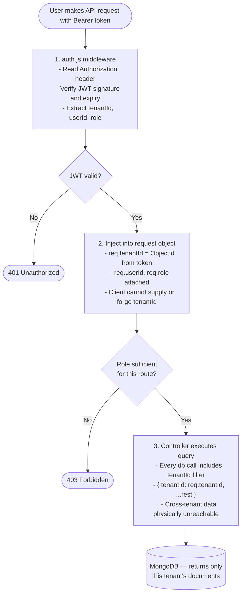
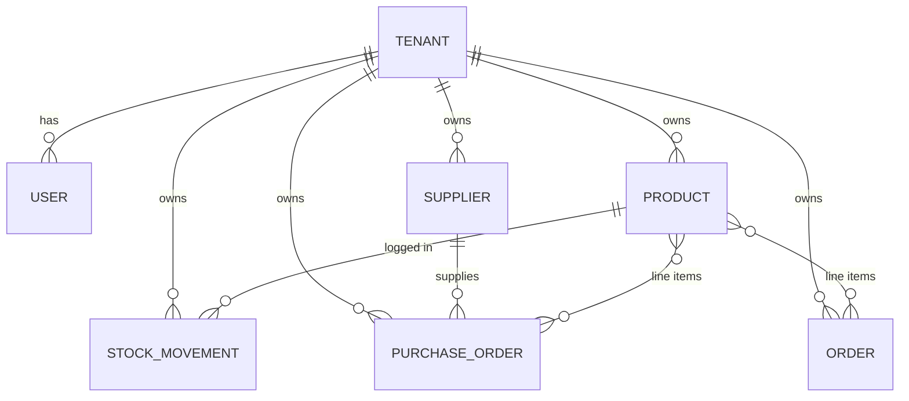
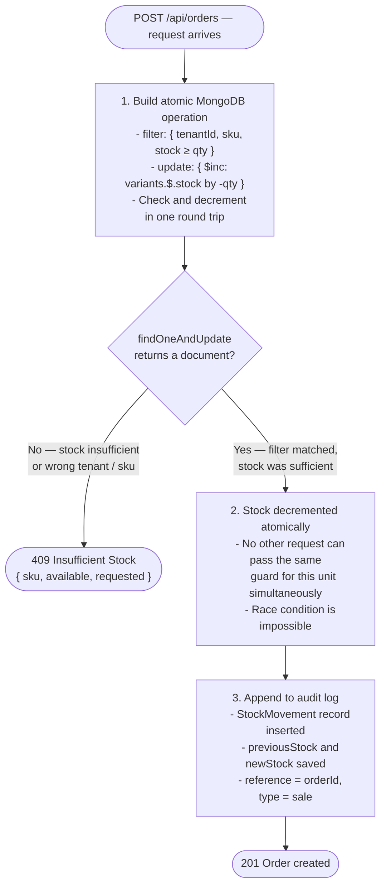
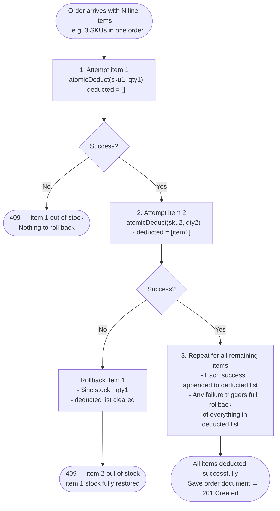
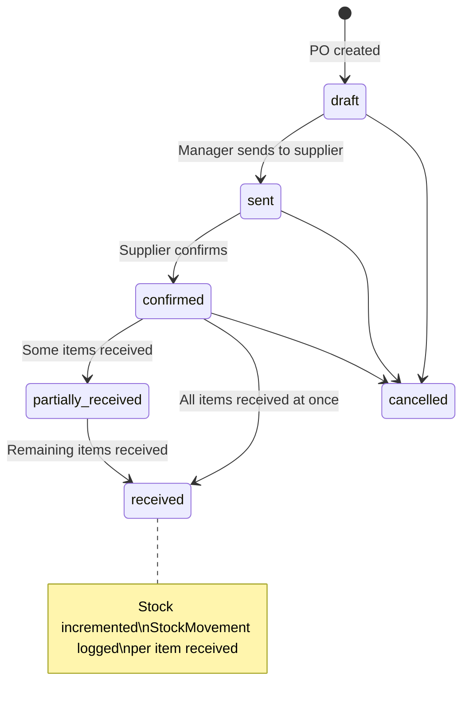
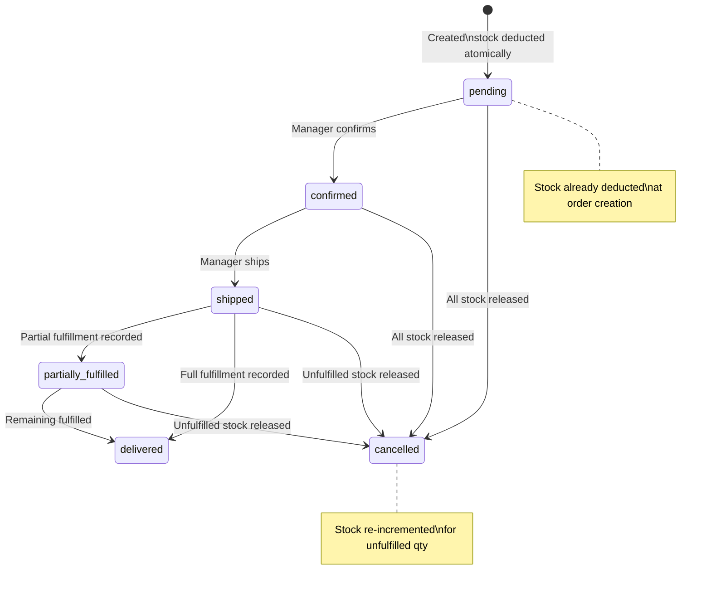
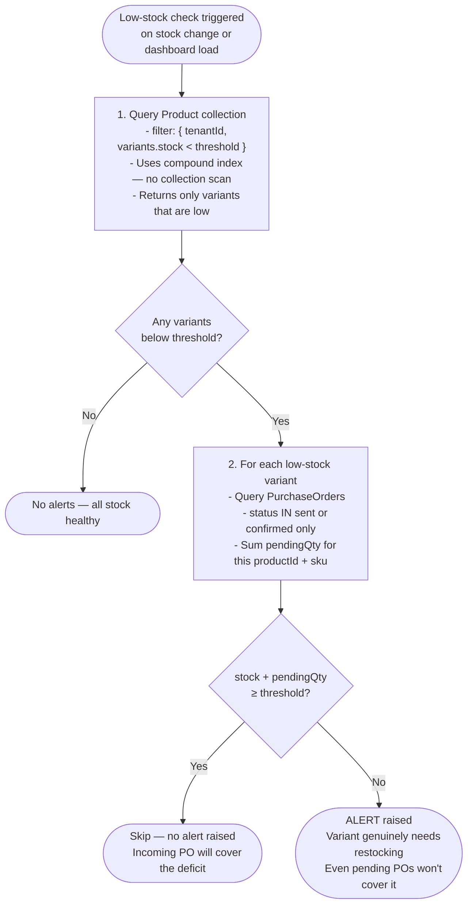

# Architecture Decision Record

---

## 1. Multi-Tenancy Approach

### What was chosen: Row-level tenancy (shared database, shared collections)

Every document in every collection carries a `tenantId` field (a MongoDB `ObjectId`). A single Express middleware — `auth.js` — decodes the JWT, reads `tenantId` from the payload, and attaches it to `req.tenantId` as a real `ObjectId`. Every controller then scopes all queries with `{ tenantId: req.tenantId }`.

### Request isolation flow



The tenantId is never passed by the client — it is always read from the verified JWT. A controller cannot accidentally query another tenant's data because the filter is injected before the controller runs.

### Why not database-per-tenant or collection-per-tenant?

| Approach | Why rejected |
|----------|-------------|
| **Database per tenant** | Requires a new MongoDB connection per request or a large connection pool; Atlas M0's free tier has strict connection limits. Schema changes need to be applied N times. Overkill for a SaaS at early scale. |
| **Collection per tenant** | Dynamic collection names break Mongoose's model system. No compound indexes across tenants. Still shares one database but adds operational complexity for no real benefit. |
| **Row-level (chosen)** | Single connection pool. Schema changes apply once. Compound indexes (`{ tenantId: 1, ... }`) keep queries fast. Works cleanly with Mongoose. Scales by upgrading the Atlas tier, not changing the schema. |

### Why middleware enforcement, not per-controller?

Putting the tenantId filter in a central middleware means it is impossible to forget it in a new controller — the query simply won't include it. A per-controller approach relies on every developer remembering to add the filter every time, which is a security gap under time pressure.

---

## 2. Data Modeling Decisions

### Document relationships



### Product variants — embedded array, not a separate collection

```
Product
└── variants: [{ sku, attributes: Map, stock, reservedStock, costPrice, sellingPrice, lowStockThreshold }]
```

**Why embedded:** Variants are never useful without their parent product. Fetching a product always means fetching its variants — a separate `variants` collection would require a `$lookup` (expensive) or application-level join on every read. More importantly, atomic stock deduction requires updating a variant's `stock` field in the same document write as the parent product — impossible across collections without multi-document transactions, which Atlas M0 does not support.

### Status history — embedded array in PO and Order

```
PurchaseOrder / Order
└── statusHistory: [{ status, changedAt, changedBy }]
```

**Why embedded:** History is always displayed with the document (on the detail page). It is append-only and bounded in size — a PO can have at most ~5 status transitions, an Order at most ~6. There is no query pattern where history is useful without its parent document, so a separate collection would add a join for no benefit.

### StockMovement — separate collection (append-only audit log)

**Why separate:** Unlike status history, the movement log is queried independently of its parent product (e.g., "show all movements across all products for this tenant this week" for the stock graph). It grows unboundedly over time — embedding it in the Product document would cause documents to grow without limit, eventually hitting MongoDB's 16 MB document cap and degrading index performance. A separate collection with its own compound indexes is the correct choice for an audit log.

### Supplier ↔ Product relationship — reference, not embed

Suppliers reference products by `productId` in a `products` array. Products reference their primary supplier by `supplierId`. **Why bidirectional reference instead of fully embedding:** Suppliers and products each exist independently and are edited independently. Embedding products inside suppliers (or vice versa) would require updating two places on every product edit, creating a consistency problem.

---

## 3. Concurrency Handling

### The problem

If two HTTP requests arrive simultaneously to place an order for the last unit in stock, a naive read-check-update pattern produces a race condition:

```
Request A: reads stock = 1  ✓ sufficient
Request B: reads stock = 1  ✓ sufficient
Request A: writes stock = 0
Request B: writes stock = -1  ← oversold
```

### Atomic guard — single item



Because the filter and the update are a single MongoDB operation, no two concurrent requests can both pass the guard for the same unit. If stock is 1 and two requests arrive simultaneously, exactly one gets the document back and one gets `null`.

**Why not optimistic locking (version field + retry)?** Optimistic locking requires a retry loop, which under high contention means many failed attempts before one succeeds — wasteful for a stock system where the correct answer is simply "sold out." The atomic `$elemMatch` guard gives an immediate, correct result in one round trip.

**Why not pessimistic locking (mutexes)?** In-process mutexes break the moment the API runs on more than one server instance. A distributed lock (e.g., Redlock) would work but adds infrastructure complexity. MongoDB's built-in atomicity is the right tool.

### Multi-item orders — manual rollback pattern



**Why not a MongoDB transaction?** Atlas M0 (free tier) does not support multi-document ACID transactions. The manual rollback pattern is the correct substitute: it is explicit, visible in the code, and handles the failure case correctly. The trade-off is that a crash between deduction and rollback could leave stock in a temporarily inconsistent state — accepted as a known limitation of the free-tier constraint.

### Purchase Order state machine



### Sales Order state machine



---

## 4. Performance Optimization Strategy

### Target: dashboard loads in under 2 seconds with 10,000+ products

Four strategies combine to achieve this:

**1. Every aggregation `$match` stage hits a compound index**

All four dashboard queries start with `{ tenantId, ... }` which is the leading key of every index. MongoDB resolves these with an index scan rather than a collection scan.

| Query | Index used |
|-------|-----------|
| Inventory value | `{ tenantId: 1 }` on Product |
| Top 5 sellers | `{ tenantId: 1, type: 1, createdAt: -1 }` on StockMovement |
| 7-day stock graph | `{ tenantId: 1, createdAt: -1 }` on StockMovement |
| Low-stock alerts | `{ tenantId: 1 }` on Product + PO query |

**2. UTC date boundaries to avoid timezone bugs**

```js
// Wrong — uses local timezone midnight, not UTC midnight
const start = new Date();
start.setHours(0, 0, 0, 0);

// Correct — unambiguous UTC boundary
const start = new Date(Date.UTC(year, month, day));
```

If the server ran in IST (+5:30), the wrong approach shifts the "last 7 days" window by 5.5 hours, causing the stock graph to miscount day boundaries in aggregation pipelines. UTC boundaries guarantee consistent results regardless of deployment region.

**3. Embedded variants avoid `$lookup` on the hot path**

Fetching a product list with stock levels requires no join — the variant stock is already inside the product document. With a separate variants collection, listing 100 products would require 100 `$lookup` stages or application-level N+1 queries.

**4. Smart low-stock alert — two-query design**



This is O(alerts × POs) rather than O(all products × all POs), which stays fast even with large catalogues because the number of low-stock variants is typically small.

---

## 5. Scalability Considerations

### What scales well with the current design

- **Row-level tenancy** — adding new tenants requires no schema changes. The `tenantId` compound indexes mean queries for any one tenant do not slow down as the total number of tenants grows. Upgrading from Atlas M0 to M10 or M30 increases throughput with no application changes.
- **Append-only StockMovement log** — separate collection means it can be archived, partitioned, or moved to a time-series database independently of the rest of the schema.
- **Stateless JWT auth** — any number of API server instances can validate tokens without shared session state. Horizontal scaling of the Express layer requires no sticky sessions.

### What would need to change at larger scale

| Limitation | What breaks | Fix |
|------------|-------------|-----|
| **Socket.io in-process** | With multiple API instances, a socket event emitted on instance A is not seen by clients on instance B | Add `socket.io-redis` adapter so all instances share a pub/sub channel |
| **Manual rollback (no transactions)** | A server crash mid-rollback leaves stock temporarily inconsistent | Upgrade to Atlas M10+ and use multi-document transactions; or implement an outbox/saga pattern |
| **No caching layer** | Dashboard aggregations re-run on every page load | Add Redis cache with a short TTL (e.g., 60 seconds) for dashboard endpoints |
| **Synchronous low-stock check** | Running the PO-aware alert query inline on every stock change adds latency to the order creation endpoint | Move to a background job queue (e.g., BullMQ) that processes alerts asynchronously |
| **No archival on StockMovement** | The audit log collection grows without bound | Add a TTL index for old records or archive to cold storage after N months |

---

## 6. Trade-offs Made

| Decision | Alternative considered | Why this was chosen | Cost accepted |
|----------|----------------------|--------------------|-----------------------|
| **Shared DB, row-level tenancy** | Database per tenant | Simpler ops, works on Atlas M0 free tier, single connection pool | Cross-tenant data leakage if `tenantId` filter is ever omitted (mitigated by central middleware) |
| **Embedded variants** | Separate `variants` collection | Atomic stock updates in one document write; no joins on product reads | Document size grows with variant count; very large variant sets (100+) would need rethinking |
| **Manual rollback for multi-item orders** | MongoDB multi-document transactions | Atlas M0 has no transaction support | Temporary inconsistency possible if server crashes mid-rollback |
| **Append-only StockMovement** | Mutable stock counters only | Full audit trail; needed for debugging, compliance, and the movement graph | Extra write on every stock change; collection grows without bound (needs TTL or archival in production) |
| **JWT in localStorage** | httpOnly cookie | Simpler to wire with Swagger UI and the Axios interceptor; no CSRF risk | Vulnerable to XSS if untrusted scripts are ever injected; acceptable for an internal SaaS tool |
| **Socket.io single-instance** | Redis pub/sub adapter from day one | Zero extra infrastructure for a single-server deployment | Does not work correctly if the API is horizontally scaled |
| **Soft delete for products** | Hard delete | Preserves historical StockMovement and Order references; no broken foreign keys | Deleted products accumulate; requires `isActive: true` filter on every product query |
| **No refresh tokens** | Short-lived access token + refresh token pair | Simpler implementation; acceptable for an internal tool with low security exposure | Token cannot be revoked before 7-day expiry; user stays logged in after a password change |
